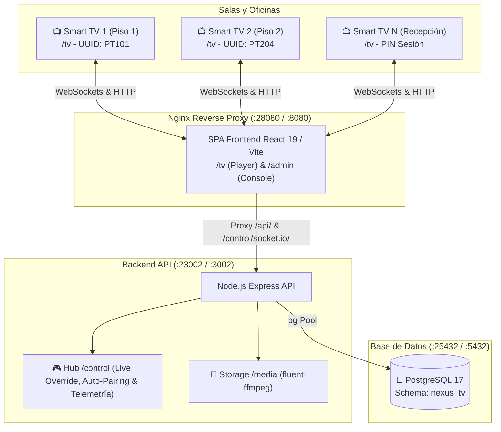

# 📺 Nexus TV Enterprise (GSI) — Sistema de Cartelería Digital & Broadcast Corporativo

Solución corporativa integral de **Cartelería Digital (Digital Signage)**, **Difusión Multimedia** y **Transmisión de Contenido Temporal en Vivo (Live Override)**, basada en arquitectura desacoplada con **Node.js Express + WebSockets Control Hub**, **PostgreSQL 17** y **Frontend SPA en React 19 / Vite / Nginx**.

---

## 📌 Overview

Nexus TV Enterprise permite a las organizaciones centralizar la gestión de pantallas informativas en sedes, edificios y pisos, combinando:
1. **Detección Automática & Vinculación Remota (Zero-Touch TV Onboarding)**: El televisor solo necesita abrir la URL `http://<servidor>:28080/tv`. La consola de administración detecta la pantalla en tiempo real con su PIN de sesión y el administrador le asigna uno de los usuarios/perfiles del SQL (`PT101`, `PT204`, `PT205`, `PT310`, `PT413`, `PT311`, `PT4123`). La TV recibe la orden por WebSocket y comienza la reproducción de inmediato sin tocar el televisor.
2. **Reproducción Multimedia Contínua (Bucle Infinito y Resiliente)**: Soporte nativo para videos MP4/WebM con reproducción en bucle sin interrupciones (incluyendo listas de un solo video), imágenes rotativas, tableros de **Microsoft Power BI** y videos de **YouTube**.
3. **Contenido Temporal en Vivo (Live Override)**: Capacidad de emitir transmisiones temporales o alertas a una pantalla específica o a todas las pantallas a la vez (`all`). Al emitir, la playlist regular se suspende de inmediato y la pantalla muestra el contenido temporal a pantalla completa. Al finalizar (o expirar la duración), la playlist se reanuda de forma transparente.
4. **Control Remoto en Tiempo Real (`/control`)**:
   - Monitoreo en vivo de pantallas y estado online/offline.
   - Control en tiempo real: Iniciar, pausar, saltar contenido, recargar pantalla y volumen remoto.
   - Activación y desbloqueo de audio nativo cumpliendo las políticas de Autoplay del navegador.
5. **Programación Inteligente por Horarios y Días**: Asignación de listas de reproducción segmentadas por franjas horarias y días de la semana.
6. **Despliegue Contenerizado Aislado**: Configurado para operar en puertos no estándar lejanos (**DB: 25432, API: 23002, Web: 28080**), evitando cualquier conflicto con entornos Docker o servicios locales preexistentes.



---

## 🗄️ Diccionario de Datos & Esquema (`nexus_tv`)

La base de datos opera bajo el esquema dedicado `nexus_tv`:

| Tabla | Descripción | Campos Clave |
| :--- | :--- | :--- |
| **`tv_screens`** | Registro y estado de televisores físicos o clientes web. | `id`, `tv_uuid` (UUID único), `name`, `location`, `is_active`, `last_login`, `created_at` |
| **`playlists`** | Colecciones nombradas de programación. | `id`, `name`, `is_public`, `created_at` |
| **`tv_playlist`** | Relación de asignación entre una pantalla y su playlist activa. | `tv_id` (FK `tv_screens`), `playlist_id` (FK `playlists`), `is_primary` (bool) |
| **`content`** | Catálogo de activos multimedia (locales o remotos). | `id`, `title`, `description`, `source_url`, `source_type` (`local_file`, `external_url`), `content_type` (`video`, `image`, `power_bi`, `url`), `duration_seconds` |
| **`playlist_content`** | Matriz de programación horaria y días asignados. | `playlist_id`, `content_id`, `start_time`, `end_time`, `days_of_week` (`text[]`) |
| **`users`** | Cuentas de acceso para administradores y editores. | `id`, `username`, `password_hash`, `email`, `role` |

---

## 🔌 API Reference

### 1. Pantallas & Reproducción (`/api/tv`)

| Método | Endpoint | Parámetros | Descripción |
| :--- | :--- | :--- | :--- |
| `POST` | `/api/tv/login` | `{ tv_uuid }` | Autentica la pantalla y actualiza `last_login`. Retorna datos de pantalla si está activa o `403` si está pendiente. |
| `GET` | `/api/tv/:tv_uuid/playlist` | `:tv_uuid` | Retorna los contenidos programados para el día actual ordenados por hora de inicio (`start_time`). |
| `POST` | `/api/tv/register` | `{ tv_uuid, name, location }` | Registra una nueva pantalla en estado pendiente de aprobación. |
| `POST` | `/api/tv/heartbeat` | `{ tv_uuid, is_override }` | Señal de vida y sincronización periódica del cliente. |

### 2. Administración & Control (`/api/admin`)

| Método | Endpoint | Parámetros | Descripción |
| :--- | :--- | :--- | :--- |
| `GET` | `/api/admin/screens` | - | Lista todas las pantallas con su estado, ubicación y playlist asignada. |
| `GET` | `/api/admin/screens/:uuid` | `:uuid` | Retorna el detalle completo y configuración de una pantalla. |
| `PUT` | `/api/admin/screens/:uuid` | `{ name, location, playlist_id, is_active }` | Actualiza los metadatos o la playlist de una pantalla. |
| `POST` | `/api/admin/screens/:uuid/control` | `{ command, payload }` | Envía una orden en vivo (`reload`, `play`, `pause`, `volume`, `unmute`, `mute`, `next`) vía WebSocket. |
| `GET` | `/api/admin/waiting-screens` | - | Lista pantallas detectadas en espera de asignación con código PIN. |
| `POST` | `/api/admin/bind-screen` | `{ sessionCode, tv_uuid }` | Asigna remotamente el perfil de usuario a la pantalla en espera. |
| `POST` | `/api/admin/temporary-content` | `{ target, content }` | Emite contenido temporal en vivo a una o todas las pantallas, deteniendo la playlist. |
| `POST` | `/api/admin/clear-temporary` | `{ target }` | Detiene la emisión temporal y reanuda la playlist normal. |
| `GET` | `/api/admin/active-temporary` | - | Consulta las transmisiones temporales activas globalmente o por pantalla. |
| `POST` | `/api/admin/temporary-control` | `{ target, action, payload }` | Control en tiempo real del contenido temporal (`play`, `pause`, `unmute`, `mute`, `volume`). |
| `GET` | `/api/admin/playlists` | - | Lista de playlists con conteo de elementos programados. |
| `POST` | `/api/admin/playlists` | `{ name, is_public }` | Crea una nueva lista de reproducción. |
| `GET` | `/api/admin/playlists/:id` | `:id` | Obtiene el detalle de la playlist y sus contenidos con horario. |
| `POST` | `/api/admin/playlists/:id/items`| `{ content_id, start_time, end_time, days_of_week }` | Asigna un contenido a una franja horaria. |
| `DELETE`| `/api/admin/playlists/:id/items/:cid` | `:id, :cid` | Retira un contenido de la playlist. |
| `GET` | `/api/admin/stats` | - | Resumen estadístico (pantallas activas, playlists, medios). |

### 3. Biblioteca Multimedia (`/api/tv-content`)

| Método | Endpoint | Formato | Descripción |
| :--- | :--- | :--- | :--- |
| `GET` | `/api/tv-content` | JSON | Catálogo completo de medios disponibles. |
| `POST` | `/api/tv-content/upload` | `multipart/form-data` | Sube video o imagen (`mediaFile`), calculando duración con `ffprobe`. |
| `POST` | `/api/tv-content/external` | JSON | Registra tableros Power BI, videos de YouTube o páginas web. |
| `POST` | `/api/tv-content/delete` | `{ content_id, fileUrl }` | Elimina registro de BD y el archivo físico en disco. |

---

## ⚡ WebSocket Hub Contracts (`/control`)

- **Conexión TV en Espera**: `io('/control', { query: { session_code: '4821', waiting_pairing: 'true' } })`
- **Conexión TV Registrada**: `io('/control', { query: { tv_uuid: 'PT101-uuid' } })`
- **Conexión Consola Admin**: `io('/control')`

### Eventos Clave del Servidor hacia la TV:
1. `command:assign_profile`: Recibe `{ tv_uuid, name, location }` y vincula automáticamente la pantalla sin intervención física.
2. `command:temporary_content`: Recibe `{ title, content_type, source_url, loop, muted, duration_seconds }`. La pantalla pausa la playlist y reproduce el temporal.
3. `command:clear_temporary`: La pantalla retira el contenido temporal y reanuda la playlist normal.
4. `command:temporary_action`: Control del temporal en vivo (`play`, `pause`, `unmute`, `mute`, `volume`).
5. `command:execute`: Comandos generales (`reload`, `play`, `pause`, `unmute`, `mute`, `volume`, `next`).

---

## 🚀 Despliegue Local Rápido

Para desplegar localmente sin riesgo de colisión de puertos:

### Opción A: Herramienta Interactiva PowerShell (Recomendada)
Ejecuta en tu terminal PowerShell:
```powershell
.\run-local.ps1
```
El script presentará el menú interactivo con opciones:
1. **Construir y Levantar Entorno Local Completo** (Crea `.env` si falta, ejecuta `docker compose up --build -d` y reporta URLs).
2. **Ver Logs en Tiempo Real** (`docker compose logs -f --tail=100`).
3. **Ver Estado de Contenedores** (`docker compose ps`).
4. **Probar Salud y Estado de Servicios** (Verifica `tv-db`, `api/status` y `tv-frontend`).
5. **Reiniciar Contenedores** (`restart`).
6. **Detener y Limpiar Entorno Local** (`down -v`).

### Opción B: Comandos Docker Compose Directos
```powershell
# Levantar servicios
docker compose up --build -d

# Validar estado
docker compose ps
```

---

## 🌐 Puertos Asignados (Puertos Aislados No Comunes)

| Servicio | Puerto Host | Puerto Contenedor | URL de Acceso |
| :--- | :--- | :--- | :--- |
| **Frontend Web SPA (Nginx)** | `28080` | `8080` | [http://localhost:28080](http://localhost:28080) |
| **Pantalla TV (Digital Signage)** | `28080` | `8080` | [http://localhost:28080/tv](http://localhost:28080/tv) |
| **Panel de Administración** | `28080` | `8080` | [http://localhost:28080/admin](http://localhost:28080/admin) |
| **Broadcast en Vivo (Override)** | `28080` | `8080` | [http://localhost:28080/admin/broadcast](http://localhost:28080/admin/broadcast) |
| **Backend API & Sockets** | `23002` | `3002` | [http://localhost:23002/api/status](http://localhost:23002/api/status) |
| **PostgreSQL Database (v17)** | `25432` | `5432` | `localhost:25432` (db: `nexus_tv`, user: `tv`) |

---

## 🛡️ Seguridad & Mejores Prácticas (OWASP)

- **Ejecución No-Root**: Los contenedores Docker ejecutan bajo usuarios del sistema dedicados (`USER app`), eliminando riesgos de escalamiento de privilegios.
- **Cabeceras Anti-Caché Estrictas**: Nginx y Express gestionan cabeceras `no-store, no-cache, must-revalidate` para evitar estados obsoletos en pantallas operadas 24/7.
- **Validación de Consultas Parametrizadas**: Todas las consultas a PostgreSQL usan `pool.query(sql, [params])` previniendo inyecciones SQL.
- **Aislamiento de Red Bridge**: Los contenedores residen en la red dedicada `tv_network`.
