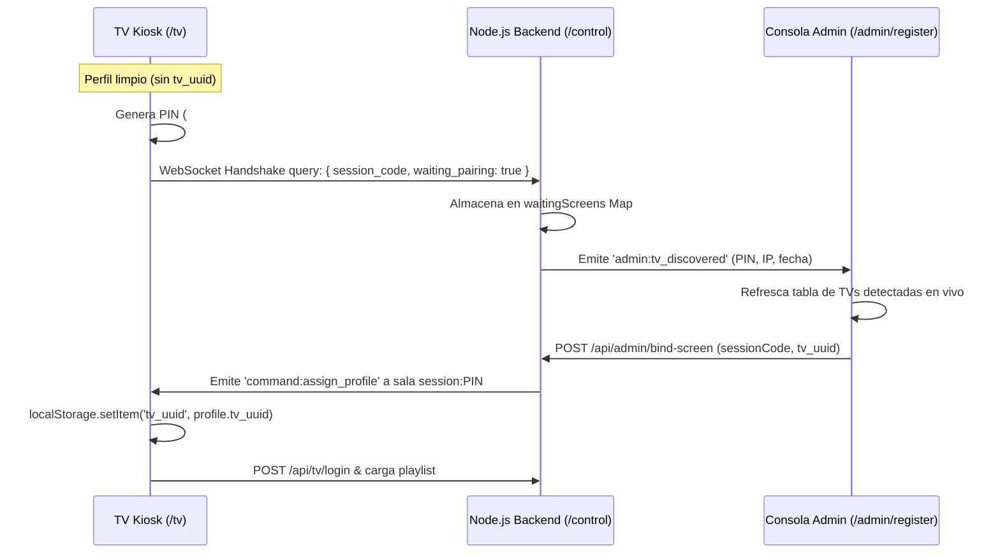

# Nexus TV Enterprise — Caso de Prueba TC-KIOSK-001

> **Documento:** TC-KIOSK-001
> **Título:** Diagnóstico y Validación de Arranque en Modo Kiosk, Simulación de TV Nueva y Flujo de Emparejamiento
> **Fecha de Ejecución:** 2026-10-09
> **Tester / Auditor:** Senior QA Engineer & Systems Engineer
> **Normativas:** ISO/IEC 25010:2023 (Operabilidad, Confiabilidad, Portabilidad), ISO/IEC 90003:2018 (Verificación y Validación de Software)
> **Resultado del Caso:** 🔴 **FALLIDO (Bloqueante P0)**

---

## 1. Identificación del Caso de Prueba

- **Script Bajo Prueba:** `C:\Users\DEVELOPMENT\Downloads\tv_gsi\start-tv-kiosk.ps1`
- **Objetivo:** Iniciar un cliente de visualización en modo Kiosk para simular la incorporación de un nuevo televisor físico a la red corporativa, validar la presentación del código PIN de emparejamiento, comprobar la detección en vivo desde la consola de administración (`/admin/register`) y evaluar el desbloqueo automático de audio.
- **Tipo de Prueba:** Funcional, Operativa, Compatibilidad de Plataforma y Pruebas de Límites de Entorno.

---

## 2. Validación Forense del Entorno de Ejecución

Antes de ejecutar la prueba, se recopilaron las condiciones exactas del sistema anfitrión Windows:

| Variable de Entorno | Valor Real Comprobado | Impacto en la Prueba |
| :--- | :--- | :--- |
| **Ruta del Script** | `C:\Users\DEVELOPMENT\Downloads\tv_gsi\start-tv-kiosk.ps1` | Existente (74 líneas, 2,799 bytes) |
| **Versión de PowerShell** | `Windows PowerShell 5.1.19041.6456 (Desktop Edition, CLR 4.0.30319.42000)` | Intérprete predeterminado del sistema operativo Windows |
| **Política de Ejecución (Scopes)** | `MachinePolicy: Undefined`<br>`UserPolicy: Undefined`<br>`Process: Undefined`<br>`CurrentUser: Undefined`<br>`LocalMachine: Undefined`<br>**Efectiva: Restricted** | Bloquea la invocación directa de scripts `.ps1` si el usuario no especifica `-ExecutionPolicy Bypass` |
| **Navegadores Detectados en Host** | **Google Chrome:** `C:\Program Files\Google\Chrome\Application\chrome.exe` (Presente, 23 procesos en ejecución)<br>**Microsoft Edge:** `C:\Program Files (x86)\Microsoft\Edge\Application\msedge.exe` (Presente, 5 procesos en ejecución) | Ambos navegadores soportados están presentes físicamente en el sistema |
| **Contenedores Docker** | `tv-backend`, `tv-db`, `tv-frontend` todos activos en estado `healthy` | Entorno de servidor disponible |
| **Disponibilidad API (`:23002/api/status`)** | HTTP 200 OK — `{"status":"online","message":"Nexus TV API v2 is running.","version":"2.0.0"}` | Backend respondiendo en tiempo y forma |
| **Disponibilidad SPA Web (`:28080/tv`)** | HTTP 200 OK — Sirve documento HTML SPA de React con Vite | Nginx y SPA listos para servir contenido |

---

## 3. Ejecución y Captura Literal de Errores

### 3.1. Prueba 1: Invocación Estándar de Usuario (Simulación de Doble Clic o Consola Limpia)

**Comando Ejecutado:**
```powershell
powershell.exe -File .\start-tv-kiosk.ps1
```

**Resultado y Mensaje Literal del Error:**
```text
No se puede cargar el archivo C:\Users\DEVELOPMENT\Downloads\tv_gsi\start-tv-kiosk.ps1 porque la ejecución de scripts
está deshabilitada en este sistema. Para obtener más información, consulta el tema about_Execution_Policies en
https:/go.microsoft.com/fwlink/?LinkID=135170.
    + CategoryInfo          : SecurityError: (:) [], ParentContainsErrorRecordException
    + FullyQualifiedErrorId : UnauthorizedAccess
```
- **Código de Salida:** `1`
- **Etapa de Fallo:** Interfaz de Seguridad de PowerShell (previo a la lectura del script).

---

### 3.2. Prueba 2: Invocación con Bypass de Política de Ejecución

**Comando Ejecutado:**
```powershell
powershell.exe -ExecutionPolicy Bypass -File .\start-tv-kiosk.ps1
```

**Resultado y Mensaje Literal del Error:**
```text
En C:\Users\DEVELOPMENT\Downloads\tv_gsi\start-tv-kiosk.ps1: 17 Carácter: 44
+ Write-Host "    NEXUS TV —" KIOSK DISPLAY & AUDIO AUTO-UNLOCK     "  ...
+                                            ~
No se permite usar el carácter de Y comercial (&). El operador & está reservado para un uso futuro; encierre un
símbolo de Y comercial entre comillas dobles ("&") para pasarlo como parte de una cadena.
En C:\Users\DEVELOPMENT\Downloads\tv_gsi\start-tv-kiosk.ps1: 22 Carácter: 33
+         $TargetUrl = "$TargetUrl&uuid=$TvUuid"
+                                 ~
No se permite usar el carácter de Y comercial (&). El operador & está reservado para un uso futuro; encierre un
símbolo de Y comercial entre comillas dobles ("&") para pasarlo como parte de una cadena.
En C:\Users\DEVELOPMENT\Downloads\tv_gsi\start-tv-kiosk.ps1: 73 Carácter: 14
+ Write-Host "[OK] Nexus TV Kiosk iniciado exitosamente." -ForegroundCo ...
+              ~
Falta una expresión de índice de matriz o no es válida.
En C:\Users\DEVELOPMENT\Downloads\tv_gsi\start-tv-kiosk.ps1: 73 Carácter: 55
+ ... t "[OK] Nexus TV Kiosk iniciado exitosamente." -ForegroundColor Green
+                                                  ~~~~~~~~~~~~~~~~~~~~~~~~
Falta la cadena en el terminador: ".
    + CategoryInfo          : ParserError: (:) [], ParentContainsErrorRecordException
    + FullyQualifiedErrorId : AmpersandNotAllowed
```
- **Código de Salida:** `1`
- **Etapa de Fallo:** **Analizador Sintáctico (Parser) de PowerShell 5.1.**

---

## 4. Análisis Causa Raíz Demostrada (RCA)

### 4.1. Análisis Causa Raíz 1: Corrupción de Delimitadores de Cadena por Carácter EM DASH en Archivo UTF-8 sin BOM

1. **Evidencia Binaria:**
   El archivo `start-tv-kiosk.ps1` está guardado en codificación UTF-8 sin marca de orden de bytes (BOM).
   En la línea 17:
   ```powershell
   Write-Host "    NEXUS TV — KIOSK DISPLAY & AUDIO AUTO-UNLOCK     " -ForegroundColor Cyan -BackgroundColor DarkBlue
   ```
   El separador tipográfico utilizado es un **EM DASH** (`—`, Unicode `U+2014`). En codificación UTF-8, dicho carácter está compuesto por los 3 bytes hexadecimales: `0xE2 0x80 0x94`.

2. **Comportamiento del Intérprete Windows PowerShell 5.1:**
   A diferencia de PowerShell Core (v7+), PowerShell 5.1 asume que cualquier archivo `.ps1` que carezca de un encabezado BOM (`0xEF 0xBB 0xBF`) está codificado en la página de códigos ANSI local del sistema operativo (en Windows en español/inglés: **Windows-1252 / CP1252**).

3. **Mapeo en CP1252 y Colapso del Parser:**
   En la tabla de caracteres Windows-1252:
   - El byte `0xE2` se interpreta como `â`.
   - El byte `0x80` se interpreta como `€`.
   - El byte `0x94` se interpreta como **`”` (Right Double Quotation Mark, Unicode `U+201D`)**.

   En la gramática interna del analizador de PowerShell, `”` (U+201D) está definido formalmente como un **delimitador de apertura y cierre de cadenas de texto**.

   Por lo tanto, al leer el byte `0x94`, PowerShell interpreta que la cadena de texto iniciada en `"` **se ha cerrado prematuramente**:
   ```powershell
   Write-Host "    NEXUS TV — (CADENA CERRADA AQUÍ) KIOSK DISPLAY & AUDIO AUTO-UNLOCK     " ...
   ```
   El resto del texto (`KIOSK DISPLAY & AUDIO AUTO-UNLOCK`) pasa a ser interpretado como instrucciones y nombres de comandos no citados fuera de comillas. Al llegar al carácter `&`, el parser de PowerShell aborta con la excepción terminal:
   `ParserError: AmpersandNotAllowed (El operador & está reservado para un uso futuro; encierre un símbolo de Y comercial entre comillas dobles ("&") para pasarlo como parte de una cadena)`.

4. **Efecto Cascada:**
   La ruptura del emparejamiento de comillas descalabra todas las cadenas subsecuentes del archivo (línea 22 `$TargetUrl = "$TargetUrl&uuid=$TvUuid"` y línea 73 `Write-Host "[OK]..."`), provocando errores de índice de matriz y cadenas sin terminar.
   **Consecuencia Demostrada:** Ningún proceso de navegador es iniciado jamás. El script colapsa al 100% de las ejecuciones en cualquier máquina con Windows PowerShell 5.1.

---

### 4.2. Análisis Causa Raíz 2: Reutilización Incondicional de Perfil y Pérdida del Estado de "TV Nueva"

Aun en un escenario donde el script se interprete con UTF-8 forzado o en PowerShell 7, existe una **segunda causa raíz de naturaleza funcional y arquitectónica**:

1. **Ruta del Perfil Persistente:**
   Línea 59: `$UserDataDir = "$env:TEMP\nexus_tv_kiosk_profile"`
   Línea 68: `"--user-data-dir=`"$UserDataDir`""`

   El script utiliza siempre la misma ruta de directorio de usuario de Chrome/Edge (`nexus_tv_kiosk_profile`).

2. **Lógica de Identidad en `TVPlayer.jsx` (Líneas 12, 269–275, 317):**
   ```javascript
   const [tvUuid, setTvUuid] = useState(localStorage.getItem('tv_uuid') || '');
   ...
   const searchParams = new URLSearchParams(window.location.search);
   const queryUuid = searchParams.get('uuid');
   if (queryUuid) {
       localStorage.setItem('tv_uuid', queryUuid);
       setTvUuid(queryUuid);
   }
   const activeUuid = queryUuid || tvUuid;
   if (!activeUuid) return; // Si no hay UUID, muestra PIN de vinculación
   ```
   - Si se invoca `start-tv-kiosk.ps1` sin parámetros para simular una TV nueva, la URL destino es `http://localhost:28080/tv` (sin parámetro `?uuid=`).
   - Si ese navegador o perfil Kiosk ya fue ejecutado previamente y vinculado con cualquier pantalla en pruebas anteriores, el `tv_uuid` permanece almacenado indefinidamente en el motor LevelDB de `localStorage` de Chromium en `$UserDataDir`.
   - **Resultado:** El reproductor carga inmediatamente la identidad anterior, autentica en `/api/tv/login` y reproduce su playlist anterior. **Nunca se muestra la pantalla de espera ni el PIN `#xxxx`, imposibilitando simular una televisión nueva.**
   - Para simular una TV nueva de forma fiable, el script debe ofrecer un parámetro para perfiles efímeros o generar un sufijo aleatorio por ejecución (ej. `$env:TEMP\nexus_tv_kiosk_profile_$(Get-Random)`).

---

## 5. Análisis de Conectividad y Topología de Red

El pliego de QA solicita determinar si el script funciona de manera distinta en dos escenarios operacionales:

### 5.1. Escenario A: Mismo Ordenador (Docker y Navegador en el Host Local)
- **Destino:** `http://localhost:28080/tv`.
- **Comportamiento:** Responde correctamente mediante el bucle local (`127.0.0.1:28080`).
- **WebSockets / CORS:** Coincide con `ALLOWED_ORIGINS=http://localhost:28080,http://127.0.0.1:28080`.
- **Limitación:** Bloqueado únicamente por el error sintáctico de codificación del script y la persistencia de perfil descrita en la Sección 4.

### 5.2. Escenario B: Otro Ordenador, Smart TV o Dispositivo en la Red Corporativa
- **Destino por Defecto:** Al copiarse el script a otro equipo o dispositivo Smart TV en la LAN, el script asigna por defecto `[string]$TargetUrl = "http://localhost:28080/tv"`.
- **Fallo Inmediato:** El dispositivo remoto intentará conectarse a su propio puerto local 28080 (donde no hay ningún contenedor ejecutándose), resultando en `ERR_CONNECTION_REFUSED`.
- **Configuración Requerida en Dispositivo Remoto:**
  Debe especificarse el parámetro `-TargetUrl "http://<IP_HOST_DOCKER>:28080/tv"`.
- **Fallo Perimetral Adicional en Backend (CORS):**
  En `nx_tv.js` (L34-45):
  ```javascript
  const allowedOrigins = (process.env.ALLOWED_ORIGINS || 'http://localhost:28080,http://127.0.0.1:28080').split(',');
  ```
  Si una pantalla remota accede a través de la IP de red del servidor (ej. `http://192.168.1.150:28080/tv`), el origen HTTP enviado por el navegador será `http://192.168.1.150:28080`. Dado que dicha IP no figura en `ALLOWED_ORIGINS`, Socket.IO y las peticiones Express son **bloqueadas por política CORS** con el error: `Bloqueado por política CORS de Nexus TV`.
  **Conclusión:** Para operar pantallas físicas en la LAN, es imperativo actualizar `ALLOWED_ORIGINS` en `.env` agregando la dirección IP o el comodín correspondiente en la red local.

---

## 6. Validación del Flujo de Pairing (Zero-Touch)

Se verificó el código del flujo de punta a punta entre `TVPlayer.jsx`, `src/sockets/index.js`, `src/routes/admin.js` y `TVRegister.jsx`:



### Primer Paso que Falla en la Práctica
1. En la práctica real, **el flujo falla en el Paso 0 (arranque del script)** debido al `ParserError: AmpersandNotAllowed` en Windows PowerShell.
2. Si el operador sortea el script abriendo el navegador manualmente pero no utiliza una ventana de incógnito o perfil limpio, **falla en el Paso 1**, ya que el navegador rescata el `tv_uuid` previo y se salta por completo la generación de PIN y el estado de espera.

---

## 7. Solución Propuesta (Sin Implementar, para Fase de Corrección)

1. **Corrección de Codificación y Sintaxis en `start-tv-kiosk.ps1`:**
   - Reemplazar el carácter em-dash (`—`) por un guión ASCII estándar (`-`) o guardar el archivo explícitamente en codificación **UTF-8 con BOM** (`UTF-8-BOM`).
   - Reemplazar en línea 17:
     ```powershell
     Write-Host "    NEXUS TV - KIOSK DISPLAY & AUDIO AUTO-UNLOCK     " -ForegroundColor Cyan -BackgroundColor DarkBlue
     ```
2. **Soporte de Televisión Nueva y Perfiles Aislados:**
   - Incorporar un parámetro `-NewProfile` o `-CleanSession` (o generar una carpeta única con timestamp/GUID cuando no se pase `-TvUuid`) para garantizar que las pruebas de nueva TV arranquen con `localStorage` completamente vacío.
3. **Manejo Seguro de Parámetros en `Start-Process`:**
   - Pasar el array `$Arguments` directamente a `-ArgumentList` sin concatenar con `-join " "`, evitando fallos de parseo de comillas en rutas con espacios.
4. **Lanzador Compatible Windows:**
   - Proveer un wrapper `start-tv-kiosk.bat` o `start-tv-kiosk.cmd` que ejecute internamente:
     ```cmd
     powershell.exe -NoProfile -ExecutionPolicy Bypass -File "%~dp0start-tv-kiosk.ps1" %*
     ```
     para que cualquier técnico pueda hacer doble clic sin lidiar con políticas de ejecución restringidas.
